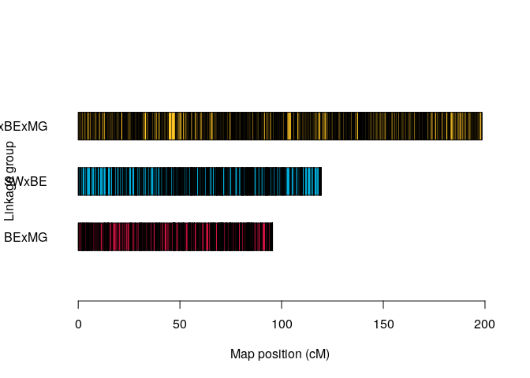
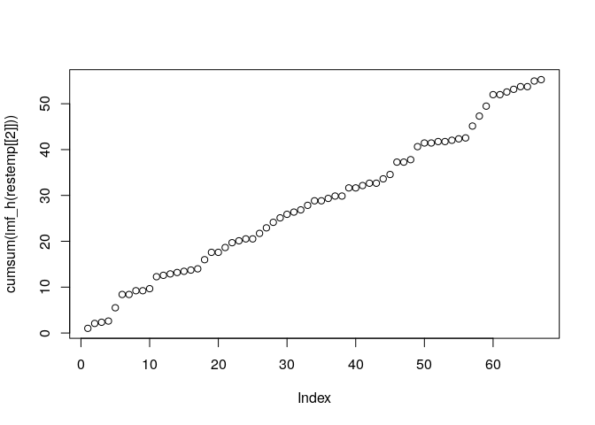

MAPpoly 2.0
================

## Background

MAPpoly 2.0 is an under development package to build genetic maps in
diploids and polyploid interconnected populations. Some of the MAPpoly
2.0 features:

- Mutli-population
- Multi-allelic (from biallelic to complete informative markers)
- Multi-ploidy (2, 4, 6 and any combination of those)

## What we have so far

The core function to re-estimate a genetic map in any of the situations
listed above is already
[implemented](https://github.com/mmollina/mappoly2/blob/main/src/est_hmm_map.cpp).
However, there is a lot of functions that need to be implemented before
we could release the package to the general public. In the next
sections, I will present some functionality that are implemented in the
current version.

### Merging maps from MAPpoly

``` r
require(mappoly2)
```

    ## Loading required package: mappoly2

    ## Warning in fun(libname, pkgname): couldn't connect to display ":0"

``` r
require(mappoly)
```

    ## Loading required package: mappoly

    ## =====================================================
    ## MAPpoly Package [Version 0.3.2]
    ## More information: https://github.com/mmollina/MAPpoly
    ## =====================================================

``` r
require(tidyverse)
```

    ## Loading required package: tidyverse

    ## ── Attaching packages ─────────────────────────────────────── tidyverse 1.3.2 ──
    ## ✔ ggplot2 3.4.0      ✔ purrr   0.3.5 
    ## ✔ tibble  3.1.8      ✔ dplyr   1.0.10
    ## ✔ tidyr   1.2.1      ✔ stringr 1.4.1 
    ## ✔ readr   2.1.3      ✔ forcats 0.5.2 
    ## ── Conflicts ────────────────────────────────────────── tidyverse_conflicts() ──
    ## ✖ dplyr::filter() masks stats::filter()
    ## ✖ dplyr::lag()    masks stats::lag()

``` r
require(reshape2)
```

    ## Loading required package: reshape2
    ## 
    ## Attaching package: 'reshape2'
    ## 
    ## The following object is masked from 'package:tidyr':
    ## 
    ##     smiths

``` r
require(plotly)
```

    ## Loading required package: plotly
    ## 
    ## Attaching package: 'plotly'
    ## 
    ## The following object is masked from 'package:ggplot2':
    ## 
    ##     last_plot
    ## 
    ## The following object is masked from 'package:stats':
    ## 
    ##     filter
    ## 
    ## The following object is masked from 'package:graphics':
    ## 
    ##     layout

``` r
source("~/repos/current_work/mappoly2/R/merge_mappoly_maps.R", echo=TRUE)
```

    ## 
    ## > prepare_maps_to_merge <- function(map.list, data.list, 
    ## +     parents.mat) {
    ## +     pl <- data.list[[1]]$ploidy
    ## +     if (any(!sapply(map.list, inher .... [TRUNCATED] 
    ## 
    ## > match_homologs <- function(map.list, par.ord) {
    ## +     idn <- Reduce(intersect, lapply(map.list, function(x) x$info$mrk.names))
    ## +     id.all <- unlis .... [TRUNCATED] 
    ## 
    ## > generate_biallelic_indices <- function(pl) {
    ## +     I <- matrix(0, 1, pl)
    ## +     for (d in 1:pl) {
    ## +         x <- combn(1:pl, d)
    ## +         y <- matrix .... [TRUNCATED] 
    ## 
    ## > compare_single_maps <- function(map.list) {
    ## +     mrk.id <- unlist(lapply(map.list, function(x) x$info$mrk.names))
    ## +     geno_pos <- unlist(lapply(m .... [TRUNCATED] 
    ## 
    ## > dose_2_vec <- function(d, pl) {
    ## +     if (is.na(d)) 
    ## +         return(rep(NA, pl))
    ## +     if (d == 0) 
    ## +         return(rep(0, pl))
    ## +     if (d > pl  .... [TRUNCATED]

``` r
map_ch1_BExMG <- readRDS("~/repos/current_work/rose/fullsib_maps/BExMG/map_err_ch_1.rds")
map_ch1_SWxBE <- readRDS("~/repos/current_work/rose/fullsib_maps/SWxBE/map_err_ch_1.rds")
dat_BExMG <- readRDS("~/repos/current_work/rose/data/dat_BExMG.rds")
dat_SWxBE <- readRDS("~/repos/current_work/rose/data/dat_SWxBE.rds")
data.list <- list(BExMG = dat_BExMG,
                  SWxBE = dat_SWxBE)
map.list <- list(BExMG = map_ch1_BExMG,
                 SWxBE = map_ch1_SWxBE)
parents.mat <- matrix(c("BE", "MG", "SW", "BE"),
                      2, 2, byrow = TRUE,
                      dimnames = list(c("pop1", "pop2"), c("P1", "P2")))

states <- prepare_maps_to_merge(map.list, data.list, parents.mat)
```

<!-- -->

``` r
restemp <- hmm_map_reconstruction(ploidy1 = states$ploidy$pl1,
                                  ploidy2 = states$ploidy$pl2,
                                  n.mrk = states$n.mrk,
                                  n.ind = states$n.ind,
                                  haplo = states$states,
                                  emit = states$emit,
                                  rf_vec = rep(0.01, states$n.mrk-1),
                                  verbose = FALSE,
                                  use_H0 = FALSE,
                                  tol = 1e-3)
dummy.map <- map_ch1_BExMG
dummy.map$maps[[1]]$seq.rf <- restemp[[2]]
dummy.map$info$mrk.names <- states$genome.pos$genome.pos$mrk
dummy.map$info$genome.pos <- states$genome.pos$genome.pos$geno.pos

l <- list(BExMG = map_ch1_BExMG,
        SWxBE = map_ch1_SWxBE,
        SWxBExMG = dummy.map)
```

``` r
plot_map_list(l, col = c(mp_pal(3)))
```

<!-- -->

``` r
compare_single_maps(l)
```

## Simulations

``` r
require(mappoly2)
require(mappoly)
ploidy.vec <- c(4, 2, 6) #four parents
names(ploidy.vec) <- c("P1", "P2", "P3")
cross.mat <- matrix(c("P1","P2",
                      "P3","P1"), 
                    ncol = 2, byrow = T)
n.mrk <- c(50,50,50) #per parent
map.length <- 50 #in centimorgans
alleles <- list(P1 = c(0:3),
                P2 = c(2:5),
                P3 = c(0:5))
n.ind <- c(100, 100) #per cross

sim.cross <- simulate_multiple_crosses(ploidy.vec,
                                       cross.mat,
                                       n.ind,
                                       n.mrk,
                                       alleles,
                                       map.length)
sim.cross$
states <- states_to_visit(sim.cross)
restemp <- hmm_map_reconstruction(ploidy1 = states$ploidy$pl1,
                                  ploidy2 = states$ploidy$pl2,
                                  n.mrk = states$n.mrk,
                                  n.ind = states$n.ind,
                                  haplo = states$states,
                                  emit = states$emit,
                                  rf_vec = rep(0.01, states$n.mrk-1),
                                  verbose = FALSE,
                                  use_H0 = FALSE,
                                  tol = 1e-4)
plot(cumsum(imf_h(restemp[[2]])))
```

<!-- -->
