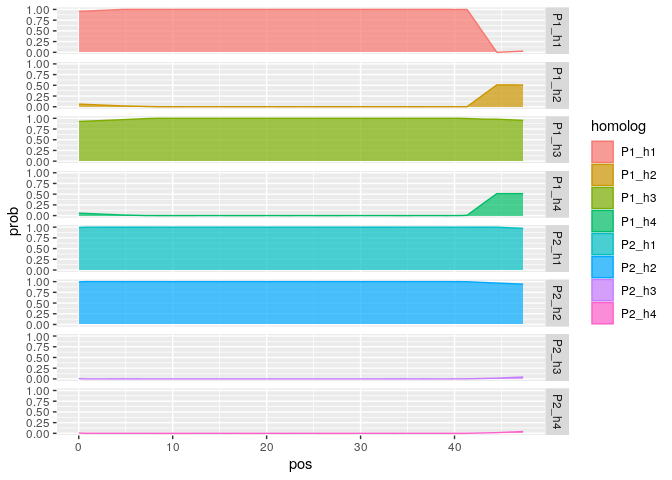

MAPpoly 2.0
================

## Background

MAPpoly 2.0 is an under-development package to build genetic maps in
diploids and polyploid interconnected populations. Some of the MAPpoly
2.0 features:

- Mutli-population
- Multi-allelic (from biallelic to complete informative markers)
- Multi-ploidy (2, 4, 6, and any combination of those)

## What we have so far

The core C++ function to re-estimate a genetic map and compute the
haplotype probabilities in any of the above situations is
[implemented](https://github.com/mmollina/mappoly2/blob/main/src/est_hmm_map.cpp).
However, several functions must be implemented before releasing the
package to the general public. In the next sections, I will present some
functionality implemented in the current version.

## TODOs

- Update functions to allow self fertilization
- Use log on the HMM to avoid underflow computations

## Merging maps from MAPpoly in a rose population

In this section, we will build a consensus map of chromosome 1 using two
tetraploid mapping populations: BExMG SWxBE. First, let us load the pre-constructed
maps in MAPpoly’s format:

``` r
require(mappoly2)
require(mappoly)
map_ch1_BExMG <- readRDS("~/repos/current_work/rose/fullsib_maps/BExMG/map_err_ch_1.rds")
map_ch1_SWxBE <- readRDS("~/repos/current_work/rose/fullsib_maps/SWxBE/map_err_ch_1.rds")
dat_BExMG <- readRDS("~/repos/current_work/rose/data/dat_BExMG.rds")
dat_SWxBE <- readRDS("~/repos/current_work/rose/data/dat_SWxBE.rds")
map.list <- list(BExMG = map_ch1_BExMG, 
                 SWxBE = map_ch1_SWxBE)
plot_map_list_consensus(map.list, col = c(2,4))
```

<!-- -->

Formatting data to MAPpoly2

``` r
data.list <- list(BExMG = dat_BExMG, 
                  SWxBE = dat_SWxBE)
parents.mat <- matrix(c("Brite_Eyes","My_Girl",
                        "Stormy_Weather","Brite_Eyes"), 
                      ncol = 2,
                      byrow = TRUE, 
                      dimnames = list(c("pop1", "pop2"), c("P1", "P2")))
```

Preparing data and assessing correspondence among homologous chromosomes
(holomogs).

``` r
w <- prepare_maps_to_merge(map.list = map.list,
                           data.list = data.list, 
                           parents.mat = parents.mat, 
                           err = 0)
```

    ##   |                                                          |                                                  |   0%  |                                                          |                                                  |   1%  |                                                          |=                                                 |   1%  |                                                          |=                                                 |   2%  |                                                          |=                                                 |   3%  |                                                          |==                                                |   3%  |                                                          |==                                                |   4%  |                                                          |==                                                |   5%  |                                                          |===                                               |   5%  |                                                          |===                                               |   6%  |                                                          |===                                               |   7%  |                                                          |====                                              |   7%  |                                                          |====                                              |   8%  |                                                          |====                                              |   9%  |                                                          |=====                                             |   9%  |                                                          |=====                                             |  10%  |                                                          |=====                                             |  11%  |                                                          |======                                            |  11%  |                                                          |======                                            |  12%  |                                                          |======                                            |  13%  |                                                          |=======                                           |  13%  |                                                          |=======                                           |  14%  |                                                          |=======                                           |  15%  |                                                          |========                                          |  15%  |                                                          |========                                          |  16%  |                                                          |========                                          |  17%  |                                                          |=========                                         |  17%  |                                                          |=========                                         |  18%  |                                                          |=========                                         |  19%  |                                                          |==========                                        |  19%  |                                                          |==========                                        |  20%  |                                                          |==========                                        |  21%  |                                                          |===========                                       |  21%  |                                                          |===========                                       |  22%  |                                                          |===========                                       |  23%  |                                                          |============                                      |  23%  |                                                          |============                                      |  24%  |                                                          |============                                      |  25%  |                                                          |=============                                     |  25%  |                                                          |=============                                     |  26%  |                                                          |=============                                     |  27%  |                                                          |==============                                    |  27%  |                                                          |==============                                    |  28%  |                                                          |==============                                    |  29%  |                                                          |===============                                   |  29%  |                                                          |===============                                   |  30%  |                                                          |===============                                   |  31%  |                                                          |================                                  |  31%  |                                                          |================                                  |  32%  |                                                          |================                                  |  33%  |                                                          |=================                                 |  33%  |                                                          |=================                                 |  34%  |                                                          |=================                                 |  35%  |                                                          |==================                                |  35%  |                                                          |==================                                |  36%  |                                                          |==================                                |  37%  |                                                          |===================                               |  37%  |                                                          |===================                               |  38%  |                                                          |===================                               |  39%  |                                                          |====================                              |  39%  |                                                          |====================                              |  40%  |                                                          |====================                              |  41%  |                                                          |=====================                             |  41%  |                                                          |=====================                             |  42%  |                                                          |=====================                             |  43%  |                                                          |======================                            |  43%  |                                                          |======================                            |  44%  |                                                          |======================                            |  45%  |                                                          |=======================                           |  45%  |                                                          |=======================                           |  46%  |                                                          |=======================                           |  47%  |                                                          |========================                          |  47%  |                                                          |========================                          |  48%  |                                                          |========================                          |  49%  |                                                          |=========================                         |  49%  |                                                          |=========================                         |  50%  |                                                          |=========================                         |  51%  |                                                          |==========================                        |  51%  |                                                          |==========================                        |  52%  |                                                          |==========================                        |  53%  |                                                          |===========================                       |  53%  |                                                          |===========================                       |  54%  |                                                          |===========================                       |  55%  |                                                          |============================                      |  55%  |                                                          |============================                      |  56%  |                                                          |============================                      |  57%  |                                                          |=============================                     |  57%  |                                                          |=============================                     |  58%  |                                                          |=============================                     |  59%  |                                                          |==============================                    |  59%  |                                                          |==============================                    |  60%  |                                                          |==============================                    |  61%  |                                                          |===============================                   |  61%  |                                                          |===============================                   |  62%  |                                                          |===============================                   |  63%  |                                                          |================================                  |  63%  |                                                          |================================                  |  64%  |                                                          |================================                  |  65%  |                                                          |=================================                 |  65%  |                                                          |=================================                 |  66%  |                                                          |=================================                 |  67%  |                                                          |==================================                |  67%  |                                                          |==================================                |  68%  |                                                          |==================================                |  69%  |                                                          |===================================               |  69%  |                                                          |===================================               |  70%  |                                                          |===================================               |  71%  |                                                          |====================================              |  71%  |                                                          |====================================              |  72%  |                                                          |====================================              |  73%  |                                                          |=====================================             |  73%  |                                                          |=====================================             |  74%  |                                                          |=====================================             |  75%  |                                                          |======================================            |  75%  |                                                          |======================================            |  76%  |                                                          |======================================            |  77%  |                                                          |=======================================           |  77%  |                                                          |=======================================           |  78%  |                                                          |=======================================           |  79%  |                                                          |========================================          |  79%  |                                                          |========================================          |  80%  |                                                          |========================================          |  81%  |                                                          |=========================================         |  81%  |                                                          |=========================================         |  82%  |                                                          |=========================================         |  83%  |                                                          |==========================================        |  83%  |                                                          |==========================================        |  84%  |                                                          |==========================================        |  85%  |                                                          |===========================================       |  85%  |                                                          |===========================================       |  86%  |                                                          |===========================================       |  87%  |                                                          |============================================      |  87%  |                                                          |============================================      |  88%  |                                                          |============================================      |  89%  |                                                          |=============================================     |  89%  |                                                          |=============================================     |  90%  |                                                          |=============================================     |  91%  |                                                          |==============================================    |  91%  |                                                          |==============================================    |  92%  |                                                          |==============================================    |  93%  |                                                          |===============================================   |  93%  |                                                          |===============================================   |  94%  |                                                          |===============================================   |  95%  |                                                          |================================================  |  95%  |                                                          |================================================  |  96%  |                                                          |================================================  |  97%  |                                                          |================================================= |  97%  |                                                          |================================================= |  98%  |                                                          |================================================= |  99%  |                                                          |==================================================|  99%  |                                                          |==================================================| 100%

Correspondence among homologous chromosomes in different crosses. In
this case, Brite Eyes is present in two crosses. Homolog C in cross 1
(BExMG) corresponds to homolog D in cross 2 (SWxBE). Yet, D corresponds
to A, A corresponds to C and B corresponds to B.

``` r
plot(w)
```

<!-- -->

Map reconstruction (without error - need to fix underflow computations)

``` r
consensus.map <- hmm_map_reconstruction(w, tol = 10e-4, verbose = FALSE)
```

Notice that the map is still longer than expected because we still need
to include the genotype errors in the algorithm

``` r
plot_map_list_consensus(map.list, consensus.map, col = mp_pallet2(3))
```

<!-- -->

Computing homolog probabilities

``` r
multi_fam_genoprob <- calc_genoprob_mutli_fam(consensus.map, step = 1)
```

Probability profiles

``` r
g <- multi_fam_genoprob$genoprob
Z1<- g %>% filter(ind == "X16400_N047")
head(Z1)
```

    ##           ind           snp       prob pos homolog
    ## 1 X16400_N047 Affx-86811403 0.98009213   0   P1_h1
    ## 2 X16400_N047 Affx-86811403 0.03914838   0   P1_h2
    ## 3 X16400_N047 Affx-86811403 0.96825905   0   P1_h3
    ## 4 X16400_N047 Affx-86811403 0.01250045   0   P1_h4
    ## 5 X16400_N047 Affx-86811403 0.01250045   0   P2_h1
    ## 6 X16400_N047 Affx-86811403 0.98586862   0   P2_h2

``` r
ggplot2::ggplot(Z1, ggplot2::aes(x = pos, y = prob, fill = homolog, color = homolog)) + 
  ggplot2::geom_density(stat = "identity", alpha = 0.7, position = "stack") + 
  ggplot2::facet_grid(rows = ggplot2::vars(homolog))
```

<!-- -->

## Simulations

### Multiallelic simulation (given phase of funders)

Let us simulate four parents:

- P1 tetraploid, 50 markers with alleles 0,1,2,3
- P2 diploid, 50 markers with alleles 2,3,4,5
- P3 hexaploid, 50 markers with alleles 0,1,2,3,4,5
- P4 tetraploid, 50 markers with alleles 0,2,6,8

crossed as follows:

- P1 x P2: 100 individuals
- P3 x P1: 100 individuals
- P4 x P2: 100 individuals
- P3 x P4: 100 individuals

map length: 50 cM

``` r
ploidy.vec <- c(4, 2, 6, 4) #three parents
names(ploidy.vec) <- c("P1", "P2", "P3", "P4")
cross.mat <- matrix(c("P1","P2",
                      "P3","P1",
                      "P4","P2",
                      "P3","P4"), 
                    ncol = 2, byrow = T)
n.mrk <- c(50,50,50,50) #per parent
map.length <- 50 #in centimorgans
alleles <- list(P1 = c(0:3),
                P2 = c(2:5),
                P3 = c(0:5),
                P4 = c(0,2,6,8))
n.ind <- c(100, 100, 100, 100) #per cross

sim.cross <- simulate_multiple_crosses(ploidy.vec,
                                       cross.mat,
                                       n.ind,
                                       n.mrk,
                                       alleles,
                                       map.length)
sim.cross
```

    ## This is an object of class mappoly2.data'
    ##     Number of founders:                      4 
    ##     Ploidy of founders:                      4 6 4 2 
    ##     No. individuals:                         400 
    ##     No. markers:                             88 
    ## 
    ## Number of individuals per crosses:    
    ##       P1  P2  P4
    ##   P1   0 100   0
    ##   P3 100   0 100
    ##   P4   0 100   0
    ## 
    ## Number of markers per allelic level:
    ##  2  3  4  5  6  7  8 
    ##  1  5 23 16 16 10  1

``` r
w <- states_to_visit(sim.cross)
```

    ##   |                                                          |                                                  |   0%  |                                                          |                                                  |   1%  |                                                          |=                                                 |   1%

``` r
map <- hmm_map_reconstruction(w, tol = 10e-4, verbose = FALSE)
```

``` r
plot_map_list_consensus(map.list = NULL, map)
```

<!-- -->

## Simulating biallelic maps, phasing with MAPpoly and merging with MAPPoly2

Simulating four tetraploid parents with 100 biallelic markers each
crossed as follows:

- P1 x P2: 100 individuals
- P1 x P3: 100 individuals
- P2 x P3: 100 individuals
- P2 x P4: 100 individuals
- P3 x P4: 100 individuals

map length: 50 cM

``` r
ploidy.vec <- c(4, 4, 4, 4) #four parents
names(ploidy.vec) <- c("P1", "P2", "P3", "P4")
parents.mat <- matrix(c("P1","P2",
                        "P1","P3",
                        "P2","P3",
                        "P2","P4",
                        "P3","P4"), ncol = 2, byrow = T)
n.mrk <- c(100,100,100,100) #per parent
map.length <- 50 #in centimorgans
alleles <- list(P1 = c(0:1),
                P2 = c(0:1),
                P3 = c(0:1),
                P4 = c(0:1))
n.ind <- c(100, 100, 100, 100, 100)
sim.cross <- simulate_multiple_crosses(ploidy.vec,
                                       parents.mat,
                                       n.ind,
                                       n.mrk,
                                       alleles,
                                       map.length)
sim.cross
```

    ## This is an object of class mappoly2.data'
    ##     Number of founders:                      4 
    ##     Ploidy of founders:                      4 4 4 4 
    ##     No. individuals:                         500 
    ##     No. markers:                             165 
    ## 
    ## Number of individuals per crosses:    
    ##       P2  P3  P4
    ##   P1 100 100   0
    ##   P2   0 100 100
    ##   P3   0   0 100
    ## 
    ## Number of markers per allelic level:
    ##   1   2 
    ##   7 143

Converting data to MAPpoly

``` r
data.list <- mappoly2_to_mappoly(dat = sim.cross)
```

Building full-sib maps

``` r
map.list <- vector("list", length(data.list))
names(map.list) <- names(data.list)
for(i in 1:length(data.list)){
  dat <- data.list[[i]]
  plot(dat)
  s <- make_seq_mappoly(dat, "all")
  tpt <- est_pairwise_rf(s)
  map.list[[i]] <- est_rf_hmm_sequential(s, tpt)
}
```

    ## INFO: Going singlemode. Using one CPU for calculation.
    ## Number of markers: 58

    ## ════════════════════════════════════════════════════════════ Initial sequence ══

    ## 4 markers...
    ## •    Trying sequence: 1 2 3 4 :
    ##        20 phase(s): . . . . . . . . . . . . . . . . . . . .

    ## ══════════════════════════════════════════════════ Done with initial sequence ══

    ## 5 /5 :(8.6%)   5 : 6 ph     (1/6)       -- tail: 4  •••| •|||  ...  •••| ||•| 
    ## 6 /6 :(10.3%)  6 : 1 ph     (1/1)       -- tail: 5  |•|| ||••                     
    ## 7 /7 :(12.1%)  7 : 16 ph    (1/16)      -- tail: 6  •||| •••|  ...  •||| ••|• 
    ## 8 /8 :(13.8%)  8 : 1 ph     (1/1)       -- tail: 7  ||•• ||||                     
    ## 9 /9 :(15.5%)  9 : 1 ph     (1/1)       -- tail: 8  |||| •••|                     
    ## 10/10:(17.2%)  10: 1 ph     (1/1)       -- tail: 9  ||•• •|||                     
    ## 11/11:(19%)    11: 2 ph     (1/2)       -- tail: 10 •|•| |||•       •||• |||• 
    ## 12/12:(20.7%)  12: 1 ph     (1/1)       -- tail: 11 ••|| •|||                     
    ## 13/13:(22.4%)  13: 1 ph     (1/1)       -- tail: 12 ••|| ||••                     
    ## 14/14:(24.1%)  14: 1 ph     (1/1)       -- tail: 13 ||•| ||•|                     
    ## 15/15:(25.9%)  15: 1 ph     (1/1)       -- tail: 14 •||• |•••                     
    ## 16/16:(27.6%)  16: 4 ph     (1/4)       -- tail: 15 •|•| ||||  ...  •||• |||| 
    ## 17/17:(29.3%)  17: 1 ph     (1/1)       -- tail: 16 |•|| |||•                     
    ## 18/18:(31%)    18: 1 ph     (1/1)       -- tail: 17 |||• |••|                     
    ## 19/19:(32.8%)  19: 1 ph     (1/1)       -- tail: 18 |••| ||||                     
    ## 20/20:(34.5%)  20: 1 ph     (1/1)       -- tail: 19 ||•| ||••                     
    ## 21/21:(36.2%)  21: 1 ph     (1/1)       -- tail: 20 ••|| |••|                     
    ## 22/22:(37.9%)  22: 1 ph     (1/1)       -- tail: 21 |||| |••|                     
    ## 23/23:(39.7%)  23: 1 ph     (1/1)       -- tail: 22 |•|| |||•                     
    ## 24/24:(41.4%)  24: 1 ph     (1/1)       -- tail: 23 •||| ||••                     
    ## 25/25:(43.1%)  25: 1 ph     (1/1)       -- tail: 24 ••|• |•||                     
    ## 26/26:(44.8%)  26: 1 ph     (1/1)       -- tail: 25 ||•| |||•                     
    ## 27/27:(46.6%)  27: 2 ph     (1/2)       -- tail: 26 |||• |•||       |||• ||•| 
    ## 28/28:(48.3%)  28: 1 ph     (1/1)       -- tail: 27 •|•| ||||                     
    ## 29/29:(50%)    29: 1 ph     (1/1)       -- tail: 28 |•|| ||••                     
    ## 30/30:(51.7%)  30: 1 ph     (1/1)       -- tail: 29 |||| ||••                     
    ## 31/31:(53.4%)  31: 1 ph     (1/1)       -- tail: 30 ••|• ||•|                     
    ## 32/32:(55.2%)  32: 1 ph     (1/1)       -- tail: 31 •||| •|||                     
    ## 33/33:(56.9%)  33: 1 ph     (1/1)       -- tail: 32 |•|| ||•|                     
    ## 34/34:(58.6%)  34: 1 ph     (1/1)       -- tail: 33 |||| •••|                     
    ## 35/35:(60.3%)  35: 1 ph     (1/1)       -- tail: 34 •||• ||••                     
    ## 36/36:(62.1%)  36: 1 ph     (1/1)       -- tail: 35 |••| •|||                     
    ## 37/37:(63.8%)  37: 1 ph     (1/1)       -- tail: 36 •||• |||•                     
    ## 38/38:(65.5%)  38: 1 ph     (1/1)       -- tail: 37 |||• •|•|                     
    ## 39/39:(67.2%)  39: 1 ph     (1/1)       -- tail: 38 |||| •||•                     
    ## 40/40:(69%)    40: 1 ph     (1/1)       -- tail: 39 |•|| ||||                     
    ## 41/41:(70.7%)  41: 1 ph     (1/1)       -- tail: 40 |||| •|•|                     
    ## 42/42:(72.4%)  42: 1 ph     (1/1)       -- tail: 41 ||•• |||•                     
    ## 43/43:(74.1%)  43: 1 ph     (1/1)       -- tail: 42 ••|| ••||                     
    ## 44/44:(75.9%)  44: 1 ph     (1/1)       -- tail: 43 |••• ||••                     
    ## 45/45:(77.6%)  45: 1 ph     (1/1)       -- tail: 44 |||| •|•|                     
    ## 46/46:(79.3%)  46: 1 ph     (1/1)       -- tail: 45 |••| ••••                     
    ## 47/47:(81%)    47: 1 ph     (1/1)       -- tail: 46 •||• ||||                     
    ## 48/48:(82.8%)  48: 1 ph     (1/1)       -- tail: 47 |||• |||•                     
    ## 49/49:(84.5%)  49: 1 ph     (1/1)       -- tail: 48 |||• •|||                     
    ## 50/50:(86.2%)  50: 1 ph     (1/1)       -- tail: 49 ••|| ||||                     
    ## 51/51:(87.9%)  51: 1 ph     (1/1)       -- tail: 50 |•|| |••|                     
    ## 52/52:(89.7%)  52: 2 ph     (1/2)       -- tail: 51 |||• |•||       |||• ||•| 
    ## 53/53:(91.4%)  53: 1 ph     (1/1)       -- tail: 52 ||•| ••||                     
    ## 54/54:(93.1%)  54: 1 ph     (1/1)       -- tail: 53 •|•| ||••                     
    ## 55/55:(94.8%)  55: 2 ph     (1/2)       -- tail: 54 |•|| •|||       |•|| |•|| 
    ## 56/56:(96.6%)  56: 1 ph     (1/1)       -- tail: 55 •|•• |••|                     
    ## 57/57:(98.3%)  57: 1 ph     (1/1)       -- tail: 56 •||| ||•|                     
    ## 58/58:(100%)   58: 1 ph     (1/1)       -- tail: 57 •||| |•••

    ## ══════════════════════════════════ Reestimating final recombination fractions ══

    ## Markers in the initial sequence: 58
    ## Mapped markers                  : 58 (100%)

    ## ════════════════════════════════════════════════════════════════════════════════

<!-- -->

    ## INFO: Going singlemode. Using one CPU for calculation.
    ## Number of markers: 58

    ## ════════════════════════════════════════════════════════════ Initial sequence ══

    ## 4 markers...
    ## •    Trying sequence: 1 2 3 4 :
    ##        64 phase(s): . . . . . . . . . . . . . . . . . . . . . . . . . . . . . . . . . . . . . . 
    ##                     . . . . . . . . . . . . . . . . . . . . . . . . . .

    ## ══════════════════════════════════════════════════ Done with initial sequence ══

    ## 5 /5 :(8.6%)   5 : 12 ph    (2/12)      -- tail: 4  ••|| |•||  ...  ••|| |||• 
    ## 6 /6 :(10.3%)  6 : 8 ph     (1/8)       -- tail: 5  •||| ••||  ...  •||| |••| 
    ## 7 /7 :(12.1%)  7 : 4 ph     (1/4)       -- tail: 6  •||| •|||  ...  •||| |•|| 
    ## 8 /8 :(13.8%)  8 : 1 ph     (1/1)       -- tail: 7  |||• ||•|                     
    ## 9 /9 :(15.5%)  9 : 1 ph     (1/1)       -- tail: 8  ||•• ||||                     
    ## 10/10:(17.2%)  10: 1 ph     (1/1)       -- tail: 9  |•|| |•••                     
    ## 11/11:(19%)    11: 1 ph     (1/1)       -- tail: 10 |||| •|||                     
    ## 12/12:(20.7%)  12: 2 ph     (1/2)       -- tail: 11 ••|| ••||       ••|| •||• 
    ## 13/13:(22.4%)  13: 1 ph     (1/1)       -- tail: 12 |||• ||||                     
    ## 14/14:(24.1%)  14: 1 ph     (1/1)       -- tail: 13 |•|• •|||                     
    ## 15/15:(25.9%)  15: 1 ph     (1/1)       -- tail: 14 |||• ||||                     
    ## 16/16:(27.6%)  16: 1 ph     (1/1)       -- tail: 15 •||| ||||                     
    ## 17/17:(29.3%)  17: 1 ph     (1/1)       -- tail: 16 •||| |•|•                     
    ## 18/18:(31%)    18: 1 ph     (1/1)       -- tail: 17 •||• ••||                     
    ## 19/19:(32.8%)  19: 1 ph     (1/1)       -- tail: 18 •||| •||•                     
    ## 20/20:(34.5%)  20: 1 ph     (1/1)       -- tail: 19 •••| •||•                     
    ## 21/21:(36.2%)  21: 1 ph     (1/1)       -- tail: 20 ••|| •|||                     
    ## 22/22:(37.9%)  22: 1 ph     (1/1)       -- tail: 21 ••|| ||||                     
    ## 23/23:(39.7%)  23: 1 ph     (1/1)       -- tail: 22 |||| •||•                     
    ## 24/24:(41.4%)  24: 1 ph     (1/1)       -- tail: 23 |•|| |•|•                     
    ## 25/25:(43.1%)  25: 1 ph     (1/1)       -- tail: 24 •••| ||•|                     
    ## 26/26:(44.8%)  26: 1 ph     (1/1)       -- tail: 25 ||•| ••||                     
    ## 27/27:(46.6%)  27: 1 ph     (1/1)       -- tail: 26 |•|• •|||                     
    ## 28/28:(48.3%)  28: 1 ph     (1/1)       -- tail: 27 •||| ||||                     
    ## 29/29:(50%)    29: 1 ph     (1/1)       -- tail: 28 |||| ||•|                     
    ## 30/30:(51.7%)  30: 1 ph     (1/1)       -- tail: 29 |•|| •|••                     
    ## 31/31:(53.4%)  31: 1 ph     (1/1)       -- tail: 30 •••• ||•|                     
    ## 32/32:(55.2%)  32: 1 ph     (1/1)       -- tail: 31 ||•• ||||                     
    ## 33/33:(56.9%)  33: 1 ph     (1/1)       -- tail: 32 •••| •|||                     
    ## 34/34:(58.6%)  34: 1 ph     (1/1)       -- tail: 33 •||| |||•                     
    ## 35/35:(60.3%)  35: 1 ph     (1/1)       -- tail: 34 |••| ||||                     
    ## 36/36:(62.1%)  36: 1 ph     (1/1)       -- tail: 35 ||•| ||•|                     
    ## 37/37:(63.8%)  37: 1 ph     (1/1)       -- tail: 36 |||| •|••                     
    ## 38/38:(65.5%)  38: 1 ph     (1/1)       -- tail: 37 |••| ••••                     
    ## 39/39:(67.2%)  39: 2 ph     (1/2)       -- tail: 38 ••|• |||•       •|•• |||• 
    ## 40/40:(69%)    40: 1 ph     (1/1)       -- tail: 39 ||•| |•||                     
    ## 41/41:(70.7%)  41: 1 ph     (1/1)       -- tail: 40 ||•| ||••                     
    ## 42/42:(72.4%)  42: 2 ph     (1/2)       -- tail: 41 •||• •|||       •||• |•|| 
    ## 43/43:(74.1%)  43: 1 ph     (1/1)       -- tail: 42 |••| ||||                     
    ## 44/44:(75.9%)  44: 1 ph     (1/1)       -- tail: 43 ||•| •|••                     
    ## 45/45:(77.6%)  45: 1 ph     (1/1)       -- tail: 44 ||•| |•||                     
    ## 46/46:(79.3%)  46: 1 ph     (1/1)       -- tail: 45 ||•| •|•|                     
    ## 47/47:(81%)    47: 1 ph     (1/1)       -- tail: 46 |||| •|||                     
    ## 48/48:(82.8%)  48: 1 ph     (1/1)       -- tail: 47 ••|• ||||                     
    ## 49/49:(84.5%)  49: 1 ph     (1/1)       -- tail: 48 ||•| ||||                     
    ## 50/50:(86.2%)  50: 1 ph     (1/1)       -- tail: 49 ||•| ||||                     
    ## 51/51:(87.9%)  51: 2 ph     (1/2)       -- tail: 50 ••|| |||•       |•|• |||• 
    ## 52/52:(89.7%)  52: 1 ph     (1/1)       -- tail: 51 |••• ••|•                     
    ## 53/53:(91.4%)  53: 1 ph     (1/1)       -- tail: 52 •||| •|•|                     
    ## 54/54:(93.1%)  54: 1 ph     (1/1)       -- tail: 53 •|•• |||•                     
    ## 55/55:(94.8%)  55: 1 ph     (1/1)       -- tail: 54 |•|| •|••                     
    ## 56/56:(96.6%)  56: 1 ph     (1/1)       -- tail: 55 •||| •|||                     
    ## 57/57:(98.3%)  57: 1 ph     (1/1)       -- tail: 56 •••| •|||                     
    ## 58/58:(100%)   58: 1 ph     (1/1)       -- tail: 57 ||•| |||•

    ## ══════════════════════════════════ Reestimating final recombination fractions ══

    ## Markers in the initial sequence: 58
    ## Mapped markers                  : 58 (100%)

    ## ════════════════════════════════════════════════════════════════════════════════

<!-- -->

    ## INFO: Going singlemode. Using one CPU for calculation.
    ## Number of markers: 56

    ## ════════════════════════════════════════════════════════════ Initial sequence ══

    ## 4 markers...
    ## •    Trying sequence: 1 2 3 4 :
    ##        4 phase(s): . . . .

    ## ══════════════════════════════════════════════════ Done with initial sequence ══

    ## 5 /5 :(8.9%)   5 : 1 ph     (1/1)       -- tail: 4  •••| •|||                     
    ## 6 /6 :(10.7%)  6 : 3 ph     (1/3)       -- tail: 5  •••| •••|  ...  ••|• •••| 
    ## 7 /7 :(12.5%)  7 : 1 ph     (1/1)       -- tail: 6  |•|| ||||                     
    ## 8 /8 :(14.3%)  8 : 3 ph     (1/3)       -- tail: 7  |•|• |••|  ...  |•|• |•|• 
    ## 9 /9 :(16.1%)  9 : 12 ph    (1/12)      -- tail: 8  •|•| •|||  ...  •|•| |•|| 
    ## 10/10:(17.9%)  10: 1 ph     (1/1)       -- tail: 9  |••• |•||                     
    ## 11/11:(19.6%)  11: 1 ph     (1/1)       -- tail: 10 •||• |||•                     
    ## 12/12:(21.4%)  12: 4 ph     (1/4)       -- tail: 11 •••| •|||  ...  •••| ||•| 
    ## 13/13:(23.2%)  13: 1 ph     (1/1)       -- tail: 12 ||•• ||••                     
    ## 14/14:(25%)    14: 1 ph     (1/1)       -- tail: 13 |•|• ||||                     
    ## 15: not included (*linkage phases*)
    ## 15/16:(28.6%)  16: 6 ph     (1/6)       -- tail: 14 •||• ••||  ...  •||• •||• 
    ## 16/17:(30.4%)  17: 1 ph     (1/1)       -- tail: 15 |||| ||•|                     
    ## 17/18:(32.1%)  18: 1 ph     (1/1)       -- tail: 16 |||• ||||                     
    ## 18/19:(33.9%)  19: 1 ph     (1/1)       -- tail: 17 |||| •|•|                     
    ## 19/20:(35.7%)  20: 2 ph     (1/2)       -- tail: 18 •|•• |••|       •|•• ||•• 
    ## 20/21:(37.5%)  21: 1 ph     (1/1)       -- tail: 19 |••| ||||                     
    ## 21/22:(39.3%)  22: 1 ph     (1/1)       -- tail: 20 |••| ||••                     
    ## 22/23:(41.1%)  23: 3 ph     (1/3)       -- tail: 21 •||• •||•  ...  |•|• •||• 
    ## 23/24:(42.9%)  24: 1 ph     (1/1)       -- tail: 22 |•|| |•||                     
    ## 24/25:(44.6%)  25: 1 ph     (1/1)       -- tail: 23 |||| ||•|                     
    ## 25/26:(46.4%)  26: 1 ph     (1/1)       -- tail: 24 |•|• ||||                     
    ## 26/27:(48.2%)  27: 2 ph     (1/2)       -- tail: 25 ||•| •||•       |||• •||• 
    ## 27/28:(50%)    28: 1 ph     (1/1)       -- tail: 26 ||•| ||||                     
    ## 28/29:(51.8%)  29: 1 ph     (1/1)       -- tail: 27 |||| ||•|                     
    ## 29/30:(53.6%)  30: 1 ph     (1/1)       -- tail: 28 ||•• ||||                     
    ## 30/31:(55.4%)  31: 1 ph     (1/1)       -- tail: 29 |••| |||•                     
    ## 31/32:(57.1%)  32: 1 ph     (1/1)       -- tail: 30 |||• •|||                     
    ## 32/33:(58.9%)  33: 2 ph     (1/2)       -- tail: 31 •|•| |•||       •|•| ||•| 
    ## 33/34:(60.7%)  34: 1 ph     (1/1)       -- tail: 32 ||•| ||•|                     
    ## 34/35:(62.5%)  35: 1 ph     (1/1)       -- tail: 33 ••|• ||||                     
    ## 35/36:(64.3%)  36: 1 ph     (1/1)       -- tail: 34 ||•| •|•|                     
    ## 36/37:(66.1%)  37: 1 ph     (1/1)       -- tail: 35 ||•| |||•                     
    ## 37/38:(67.9%)  38: 1 ph     (1/1)       -- tail: 36 |||• |•|•                     
    ## 38/39:(69.6%)  39: 1 ph     (1/1)       -- tail: 37 ||•• ||||                     
    ## 39/40:(71.4%)  40: 1 ph     (1/1)       -- tail: 38 •||| ••||                     
    ## 40/41:(73.2%)  41: 1 ph     (1/1)       -- tail: 39 •|•| |•||                     
    ## 41/42:(75%)    42: 1 ph     (1/1)       -- tail: 40 •||• |•••                     
    ## 42/43:(76.8%)  43: 1 ph     (1/1)       -- tail: 41 ||•• |||•                     
    ## 43/44:(78.6%)  44: 1 ph     (1/1)       -- tail: 42 ••|• |•||                     
    ## 44/45:(80.4%)  45: 1 ph     (1/1)       -- tail: 43 |•|| |•••                     
    ## 45/46:(82.1%)  46: 1 ph     (1/1)       -- tail: 44 |••• •||•                     
    ## 46/47:(83.9%)  47: 1 ph     (1/1)       -- tail: 45 •||| |•||                     
    ## 47/48:(85.7%)  48: 1 ph     (1/1)       -- tail: 46 •••• ||•|                     
    ## 48/49:(87.5%)  49: 1 ph     (1/1)       -- tail: 47 |||• |•••                     
    ## 49/50:(89.3%)  50: 1 ph     (1/1)       -- tail: 48 •||| |••|                     
    ## 50/51:(91.1%)  51: 1 ph     (1/1)       -- tail: 49 ••|• •|••                     
    ## 51/52:(92.9%)  52: 1 ph     (1/1)       -- tail: 50 |•|| ||||                     
    ## 52/53:(94.6%)  53: 1 ph     (1/1)       -- tail: 51 ||•• |||•                     
    ## 53/54:(96.4%)  54: 1 ph     (1/1)       -- tail: 52 |••| •|••                     
    ## 54/55:(98.2%)  55: 1 ph     (1/1)       -- tail: 53 •|•| ••||                     
    ## 55/56:(100%)   56: 2 ph     (1/2)       -- tail: 54 ••|• |•••       |••• |•••

    ## ══════════════════════════════════ Reestimating final recombination fractions ══

    ## Markers in the initial sequence: 56
    ## Mapped markers                  : 55 (98.2%)

    ## ════════════════════════════════════════════════════════════════════════════════

<!-- -->

    ## INFO: Going singlemode. Using one CPU for calculation.
    ## Number of markers: 55

    ## ════════════════════════════════════════════════════════════ Initial sequence ══

    ## 4 markers...
    ## •    Trying sequence: 1 2 3 4 :
    ##        8 phase(s): . . . . . . . .

    ## ══════════════════════════════════════════════════ Done with initial sequence ══

    ## 5 /5 :(9.1%)   5 : 3 ph     (1/3)       -- tail: 4  •||| ||||  ...  |•|| |||| 
    ## 6 /6 :(10.9%)  6 : 4 ph     (1/4)       -- tail: 5  ••|| •••|  ...  ••|| ••|• 
    ## 7 /7 :(12.7%)  7 : 6 ph     (1/6)       -- tail: 6  •••| •|||  ...  •••| |•|| 
    ## 8 /8 :(14.5%)  8 : 20 ph    (1/20)      -- tail: 7  •|•| ••||  ...  •|•| •||• 
    ## 9 /9 :(16.4%)  9 : 1 ph     (1/1)       -- tail: 8  |||| |•||                     
    ## 10/10:(18.2%)  10: 1 ph     (1/1)       -- tail: 9  |•|| |•||                     
    ## 11/11:(20%)    11: 2 ph     (1/2)       -- tail: 10 •||| •|||       •||| ||•| 
    ## 12/12:(21.8%)  12: 2 ph     (1/2)       -- tail: 11 ••|| •|•|       ••|| |••| 
    ## 13/13:(23.6%)  13: 1 ph     (1/1)       -- tail: 12 |||• |||•                     
    ## 14/14:(25.5%)  14: 2 ph     (1/2)       -- tail: 13 |||| •|•|       |||| •||• 
    ## 15/15:(27.3%)  15: 1 ph     (1/1)       -- tail: 14 |•|| |•|•                     
    ## 16/16:(29.1%)  16: 1 ph     (1/1)       -- tail: 15 •||• •|||                     
    ## 17/17:(30.9%)  17: 1 ph     (1/1)       -- tail: 16 |••• |•|•                     
    ## 18/18:(32.7%)  18: 1 ph     (1/1)       -- tail: 17 |||| |•||                     
    ## 19/19:(34.5%)  19: 2 ph     (1/2)       -- tail: 18 ••|| |••|       |•|• |••| 
    ## 20/20:(36.4%)  20: 1 ph     (1/1)       -- tail: 19 •||• •|||                     
    ## 21/21:(38.2%)  21: 1 ph     (1/1)       -- tail: 20 |•|• •|•|                     
    ## 22/22:(40%)    22: 1 ph     (1/1)       -- tail: 21 •||| ••||                     
    ## 23/23:(41.8%)  23: 1 ph     (1/1)       -- tail: 22 |||| •|||                     
    ## 24/24:(43.6%)  24: 1 ph     (1/1)       -- tail: 23 ••|| ||•|                     
    ## 25/25:(45.5%)  25: 1 ph     (1/1)       -- tail: 24 |||• •••|                     
    ## 26/26:(47.3%)  26: 1 ph     (1/1)       -- tail: 25 |||| •|•|                     
    ## 27/27:(49.1%)  27: 1 ph     (1/1)       -- tail: 26 ||•• ||||                     
    ## 28/28:(50.9%)  28: 1 ph     (1/1)       -- tail: 27 ||•• |••|                     
    ## 29/29:(52.7%)  29: 1 ph     (1/1)       -- tail: 28 |||| •||•                     
    ## 30/30:(54.5%)  30: 1 ph     (1/1)       -- tail: 29 |||• •|••                     
    ## 31/31:(56.4%)  31: 1 ph     (1/1)       -- tail: 30 ||•| •||•                     
    ## 32/32:(58.2%)  32: 1 ph     (1/1)       -- tail: 31 •••| |••|                     
    ## 33/33:(60%)    33: 1 ph     (1/1)       -- tail: 32 •|•• •|||                     
    ## 34/34:(61.8%)  34: 1 ph     (1/1)       -- tail: 33 |•|• ||•|                     
    ## 35/35:(63.6%)  35: 1 ph     (1/1)       -- tail: 34 ||•• •|||                     
    ## 36/36:(65.5%)  36: 1 ph     (1/1)       -- tail: 35 |•|| ||•|                     
    ## 37/37:(67.3%)  37: 1 ph     (1/1)       -- tail: 36 •|•| ||•|                     
    ## 38/38:(69.1%)  38: 1 ph     (1/1)       -- tail: 37 |•|• ||||                     
    ## 39/39:(70.9%)  39: 1 ph     (1/1)       -- tail: 38 •||| •|•|                     
    ## 40/40:(72.7%)  40: 1 ph     (1/1)       -- tail: 39 •|•• •||•                     
    ## 41/41:(74.5%)  41: 1 ph     (1/1)       -- tail: 40 ••|• •|||                     
    ## 42/42:(76.4%)  42: 1 ph     (1/1)       -- tail: 41 ||•| |•••                     
    ## 43/43:(78.2%)  43: 1 ph     (1/1)       -- tail: 42 ||•• |••|                     
    ## 44/44:(80%)    44: 1 ph     (1/1)       -- tail: 43 •••• |||•                     
    ## 45/45:(81.8%)  45: 1 ph     (1/1)       -- tail: 44 |||| ||••                     
    ## 46/46:(83.6%)  46: 1 ph     (1/1)       -- tail: 45 |•|| |•||                     
    ## 47/47:(85.5%)  47: 1 ph     (1/1)       -- tail: 46 •||• •||•                     
    ## 48/48:(87.3%)  48: 1 ph     (1/1)       -- tail: 47 ||•• |•|•                     
    ## 49/49:(89.1%)  49: 1 ph     (1/1)       -- tail: 48 •|•| ••|•                     
    ## 50/50:(90.9%)  50: 1 ph     (1/1)       -- tail: 49 |||| ||••                     
    ## 51/51:(92.7%)  51: 1 ph     (1/1)       -- tail: 50 |||| ||•|                     
    ## 52/52:(94.5%)  52: 1 ph     (1/1)       -- tail: 51 |•|• ||••                     
    ## 53/53:(96.4%)  53: 1 ph     (1/1)       -- tail: 52 ||•| |••|                     
    ## 54/54:(98.2%)  54: 1 ph     (1/1)       -- tail: 53 |||• •||•                     
    ## 55/55:(100%)   55: 1 ph     (1/1)       -- tail: 54 |••• •||•

    ## ══════════════════════════════════ Reestimating final recombination fractions ══

    ## Markers in the initial sequence: 55
    ## Mapped markers                  : 55 (100%)

    ## ════════════════════════════════════════════════════════════════════════════════

<!-- -->

    ## INFO: Going singlemode. Using one CPU for calculation.
    ## Number of markers: 58

    ## ════════════════════════════════════════════════════════════ Initial sequence ══

    ## 4 markers...
    ## •    Trying sequence: 1 2 3 4 :
    ##        12 phase(s): . . . . . . . . . . . .

    ## ══════════════════════════════════════════════════ Done with initial sequence ══

    ## 5 /5 :(8.6%)   5 : 3 ph     (3/3)       -- tail: 4  |||| ||••  ...  |||| |••| 
    ## 6 /6 :(10.3%)  6 : 5 ph     (3/5)       -- tail: 5  ||•• •|••  ...  ||•• •|•• 
    ## 7 /7 :(12.1%)  7 : 4 ph     (1/4)       -- tail: 6  ||•| ||•|  ...  ||•| |||• 
    ## 8 /8 :(13.8%)  8 : 12 ph    (1/12)      -- tail: 7  •||| ••||  ...  •||| •||• 
    ## 9 /9 :(15.5%)  9 : 1 ph     (1/1)       -- tail: 8  |||| |||•                     
    ## 10/10:(17.2%)  10: 1 ph     (1/1)       -- tail: 9  |||| •|•|                     
    ## 11/11:(19%)    11: 2 ph     (1/2)       -- tail: 10 •||| •|||       ||•| •||| 
    ## 12/12:(20.7%)  12: 1 ph     (1/1)       -- tail: 11 ||•• |•||                     
    ## 13/13:(22.4%)  13: 1 ph     (1/1)       -- tail: 12 |||| •|||                     
    ## 14/14:(24.1%)  14: 1 ph     (1/1)       -- tail: 13 •||| ||||                     
    ## 15/15:(25.9%)  15: 1 ph     (1/1)       -- tail: 14 |||| |•|•                     
    ## 16/16:(27.6%)  16: 1 ph     (1/1)       -- tail: 15 |•|• |•|•                     
    ## 17/17:(29.3%)  17: 1 ph     (1/1)       -- tail: 16 •|•| |•|•                     
    ## 18/18:(31%)    18: 5 ph     (1/5)       -- tail: 17 ••|| ||•|  ...  •|•| ||•| 
    ## 19/19:(32.8%)  19: 1 ph     (1/1)       -- tail: 18 •||| |||•                     
    ## 20/20:(34.5%)  20: 1 ph     (1/1)       -- tail: 19 |||| ||•|                     
    ## 21/21:(36.2%)  21: 1 ph     (1/1)       -- tail: 20 |||| •••|                     
    ## 22/22:(37.9%)  22: 1 ph     (1/1)       -- tail: 21 |•|• •|•|                     
    ## 23/23:(39.7%)  23: 1 ph     (1/1)       -- tail: 22 ||•| |•||                     
    ## 24/24:(41.4%)  24: 1 ph     (1/1)       -- tail: 23 ||•| ||••                     
    ## 25/25:(43.1%)  25: 1 ph     (1/1)       -- tail: 24 •||| ||•|                     
    ## 26/26:(44.8%)  26: 1 ph     (1/1)       -- tail: 25 |||| •|||                     
    ## 27/27:(46.6%)  27: 1 ph     (1/1)       -- tail: 26 |•|• •|••                     
    ## 28/28:(48.3%)  28: 1 ph     (1/1)       -- tail: 27 •||| •|•|                     
    ## 29/29:(50%)    29: 1 ph     (1/1)       -- tail: 28 ||•| ||||                     
    ## 30/30:(51.7%)  30: 1 ph     (1/1)       -- tail: 29 |||| ||•|                     
    ## 31/31:(53.4%)  31: 1 ph     (1/1)       -- tail: 30 ||•| ||||                     
    ## 32/32:(55.2%)  32: 1 ph     (1/1)       -- tail: 31 |||| •|||                     
    ## 33/33:(56.9%)  33: 1 ph     (1/1)       -- tail: 32 •||| •••|                     
    ## 34/34:(58.6%)  34: 1 ph     (1/1)       -- tail: 33 |||| •||•                     
    ## 35/35:(60.3%)  35: 1 ph     (1/1)       -- tail: 34 |||| •|||                     
    ## 36/36:(62.1%)  36: 1 ph     (1/1)       -- tail: 35 ||•| ||||                     
    ## 37/37:(63.8%)  37: 1 ph     (1/1)       -- tail: 36 |||| |•••                     
    ## 38/38:(65.5%)  38: 2 ph     (1/2)       -- tail: 37 |•|| ||||       |||• |||| 
    ## 39/39:(67.2%)  39: 1 ph     (1/1)       -- tail: 38 •••• •|•|                     
    ## 40/40:(69%)    40: 2 ph     (1/2)       -- tail: 39 |•|| ||||       |||• |||| 
    ## 41/41:(70.7%)  41: 1 ph     (1/1)       -- tail: 40 •|•• •|•|                     
    ## 42/42:(72.4%)  42: 1 ph     (1/1)       -- tail: 41 ••|| |•|•                     
    ## 43/43:(74.1%)  43: 1 ph     (1/1)       -- tail: 42 |•|• ||•|                     
    ## 44/44:(75.9%)  44: 1 ph     (1/1)       -- tail: 43 ||•| ••|•                     
    ## 45/45:(77.6%)  45: 1 ph     (1/1)       -- tail: 44 •||| |•||                     
    ## 46/46:(79.3%)  46: 1 ph     (1/1)       -- tail: 45 |||| ••||                     
    ## 47/47:(81%)    47: 1 ph     (1/1)       -- tail: 46 |•|| •|||                     
    ## 48/48:(82.8%)  48: 1 ph     (1/1)       -- tail: 47 •|•• |||•                     
    ## 49/49:(84.5%)  49: 1 ph     (1/1)       -- tail: 48 |•|| ||||                     
    ## 50/50:(86.2%)  50: 1 ph     (1/1)       -- tail: 49 |||| |•||                     
    ## 51/51:(87.9%)  51: 1 ph     (1/1)       -- tail: 50 |||• ••||                     
    ## 52/52:(89.7%)  52: 1 ph     (1/1)       -- tail: 51 |•|• |•••                     
    ## 53/53:(91.4%)  53: 1 ph     (1/1)       -- tail: 52 •||| |||•                     
    ## 54/54:(93.1%)  54: 2 ph     (1/2)       -- tail: 53 ||•| |||•       |||• |||• 
    ## 55/55:(94.8%)  55: 1 ph     (1/1)       -- tail: 54 |•|• ||•|                     
    ## 56/56:(96.6%)  56: 1 ph     (1/1)       -- tail: 55 •||| ||•|                     
    ## 57/57:(98.3%)  57: 1 ph     (1/1)       -- tail: 56 •||| ||||                     
    ## 58/58:(100%)   58: 1 ph     (1/1)       -- tail: 57 |||• ••|•

    ## ══════════════════════════════════ Reestimating final recombination fractions ══

    ## Markers in the initial sequence: 58
    ## Mapped markers                  : 58 (100%)

    ## ════════════════════════════════════════════════════════════════════════════════

<!-- -->

``` r
plot_map_list(map.list, col = mp_pallet2(5))
```

<!-- -->

Preparing data and assessing correspondence among homologous chromosomes
(holomogs).

``` r
w <- prepare_maps_to_merge(map.list = map.list,
                           data.list = data.list,
                           parents.mat = parents.mat,
                           err = 0)
```

    ##   |                                                          |                                                  |   0%  |                                                          |                                                  |   1%  |                                                          |=                                                 |   1%  |                                                          |=                                                 |   2%  |                                                          |=                                                 |   3%  |                                                          |==                                                |   3%  |                                                          |==                                                |   4%  |                                                          |==                                                |   5%  |                                                          |===                                               |   6%  |                                                          |===                                               |   7%  |                                                          |====                                              |   8%  |                                                          |=====                                             |   9%  |                                                          |=====                                             |  10%  |                                                          |======                                            |  11%  |                                                          |======                                            |  12%  |                                                          |======                                            |  13%  |                                                          |=======                                           |  13%  |                                                          |=======                                           |  14%  |                                                          |=======                                           |  15%  |                                                          |========                                          |  15%  |                                                          |========                                          |  16%  |                                                          |========                                          |  17%  |                                                          |=========                                         |  17%  |                                                          |=========                                         |  18%  |                                                          |=========                                         |  19%  |                                                          |==========                                        |  20%  |                                                          |==========                                        |  21%  |                                                          |===========                                       |  22%  |                                                          |============                                      |  23%  |                                                          |============                                      |  24%  |                                                          |=============                                     |  25%  |                                                          |=============                                     |  26%  |                                                          |=============                                     |  27%  |                                                          |==============                                    |  27%  |                                                          |==============                                    |  28%  |                                                          |==============                                    |  29%  |                                                          |===============                                   |  29%  |                                                          |===============                                   |  30%  |                                                          |===============                                   |  31%  |                                                          |================                                  |  31%  |                                                          |================                                  |  32%  |                                                          |================                                  |  33%  |                                                          |=================                                 |  34%  |                                                          |=================                                 |  35%  |                                                          |==================                                |  36%  |                                                          |===================                               |  37%  |                                                          |===================                               |  38%  |                                                          |====================                              |  39%  |                                                          |====================                              |  40%  |                                                          |====================                              |  41%  |                                                          |=====================                             |  41%  |                                                          |=====================                             |  42%  |                                                          |=====================                             |  43%  |                                                          |======================                            |  43%  |                                                          |======================                            |  44%  |                                                          |======================                            |  45%  |                                                          |=======================                           |  45%  |                                                          |=======================                           |  46%  |                                                          |=======================                           |  47%  |                                                          |========================                          |  48%  |                                                          |========================                          |  49%  |                                                          |=========================                         |  50%  |                                                          |==========================                        |  51%  |                                                          |==========================                        |  52%  |                                                          |===========================                       |  53%  |                                                          |===========================                       |  54%  |                                                          |===========================                       |  55%  |                                                          |============================                      |  55%  |                                                          |============================                      |  56%  |                                                          |============================                      |  57%  |                                                          |=============================                     |  57%  |                                                          |=============================                     |  58%  |                                                          |=============================                     |  59%  |                                                          |==============================                    |  59%  |                                                          |==============================                    |  60%  |                                                          |==============================                    |  61%  |                                                          |===============================                   |  62%  |                                                          |===============================                   |  63%  |                                                          |================================                  |  64%  |                                                          |=================================                 |  65%  |                                                          |=================================                 |  66%  |                                                          |==================================                |  67%  |                                                          |==================================                |  68%  |                                                          |==================================                |  69%  |                                                          |===================================               |  69%  |                                                          |===================================               |  70%  |                                                          |===================================               |  71%  |                                                          |====================================              |  71%  |                                                          |====================================              |  72%  |                                                          |====================================              |  73%  |                                                          |=====================================             |  73%  |                                                          |=====================================             |  74%  |                                                          |=====================================             |  75%  |                                                          |======================================            |  76%  |                                                          |======================================            |  77%  |                                                          |=======================================           |  78%  |                                                          |========================================          |  79%  |                                                          |========================================          |  80%  |                                                          |=========================================         |  81%  |                                                          |=========================================         |  82%  |                                                          |=========================================         |  83%  |                                                          |==========================================        |  83%  |                                                          |==========================================        |  84%  |                                                          |==========================================        |  85%  |                                                          |===========================================       |  85%  |                                                          |===========================================       |  86%  |                                                          |===========================================       |  87%  |                                                          |============================================      |  87%  |                                                          |============================================      |  88%  |                                                          |============================================      |  89%  |                                                          |=============================================     |  90%  |                                                          |=============================================     |  91%  |                                                          |==============================================    |  92%  |                                                          |===============================================   |  93%  |                                                          |===============================================   |  94%  |                                                          |================================================  |  95%  |                                                          |================================================  |  96%  |                                                          |================================================  |  97%  |                                                          |================================================= |  97%  |                                                          |================================================= |  98%  |                                                          |================================================= |  99%  |                                                          |==================================================|  99%  |                                                          |==================================================| 100%

Correspondence among homologous chromosomes in different crosses.

``` r
plot(w)
```

<!-- -->

``` r
consensus.map <- hmm_map_reconstruction(w, tol = 10e-4, verbose = FALSE)
```

``` r
plot_map_list_consensus(map.list, consensus.map, col = mp_pallet2(6))
```

<!-- -->

``` r
multi_fam_genoprob <- calc_genoprob_mutli_fam(consensus.map, step = 1)
```

``` r
g <- multi_fam_genoprob$genoprob
Z1<- g %>% filter(ind == unique(g$ind)[1])
head(Z1)
```

    ##           ind snp       prob pos homolog
    ## 1 Ind_P1xP2_1  M1 0.95512461   0   P1_h1
    ## 2 Ind_P1xP2_1  M1 0.06143484   0   P1_h2
    ## 3 Ind_P1xP2_1  M1 0.92662983   0   P1_h3
    ## 4 Ind_P1xP2_1  M1 0.05681072   0   P1_h4
    ## 5 Ind_P1xP2_1  M1 0.99258438   0   P2_h1
    ## 6 Ind_P1xP2_1  M1 0.99258438   0   P2_h2

``` r
ggplot2::ggplot(Z1, ggplot2::aes(x = pos, y = prob, fill = homolog, color = homolog)) +
  ggplot2::geom_density(stat = "identity", alpha = 0.7, position = "stack") +
  ggplot2::facet_grid(rows = ggplot2::vars(homolog))
```

<!-- -->
